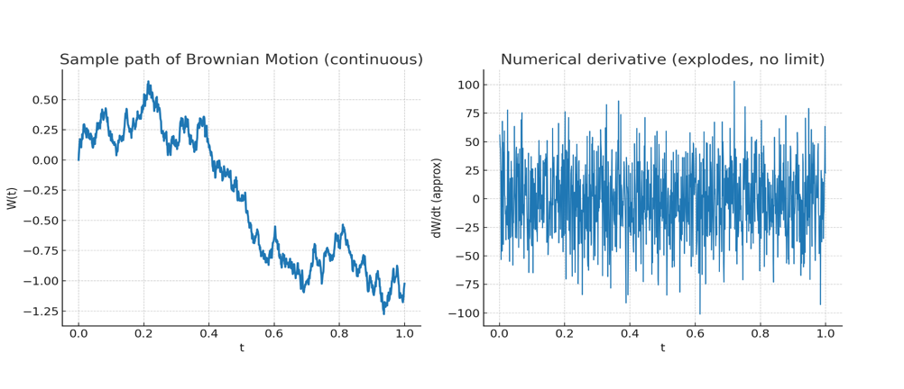

# Table of Contents
1. [Introduction](#introduction)
2. [Brownian Motion: The Language of Noise](#brownian-motion-the-language-of-noise)

## Introduction 

In recent times, diffusion models have reshaped generative AI. They create stunning images, music, and even 3D worlds—all by starting from pure noise and then running time backwards. But behind the effective technique lies some deep mathematics: stochastic differential equations (SDEs) and Itô calculus.
This post walks through how the math of randomness—developed for physics and finance—became the backbone of today’s AI.

## Brownian Motion: The Language of Noise

At the heart of stochastic Calculus lies Brownian Motion, denoted by the Stochastic Random Process $$\{W_t\}_{t}$$ with the below properties:  
- $$W_{0} = 0$$
- Increments are independent and normally distributed:
  $$W_{t+\Delta t} - W_{t} \sim \mathbb{N}(0,\Delta t)$$
  This is exactly the kind of noise we inject in diffusion models: tiny Gaussian perturbations step by step.
- Brownian motion $$W_t$$ is path continuous as function of $$t$$ but, it's not differentiable.

Below is a plot of Brownian Motion:

